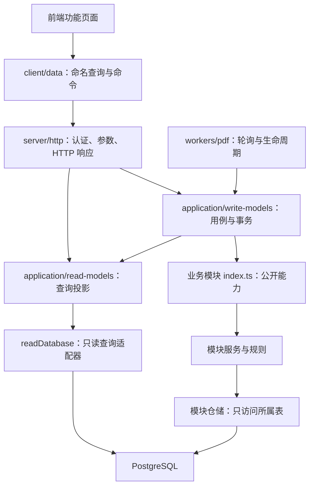

# 系统架构与模块边界

本项目采用模块化单体：前后台共用一个 API 和 PostgreSQL，PDF 转换运行在独立工作进程。模块之间通过应用层读模型和写模型协作，不直接调用彼此的实现，也不直接读写其他模块拥有的表。

这次重构不改变数据库结构、接口地址或现有资料。Windows/Linux 启动配置沿用 README；开发启动仍为 `npm start`，生产环境重新构建后运行 API 和 PDF worker。

## 1. 依赖方向



- **HTTP 层**只处理认证、CSRF、参数校验、上传协议、取消请求和响应；不得直接调用业务模块或执行 SQL。
- **写模型**组织完整用例。涉及多个模块时，在同一个数据库事务中调用各模块公开命令；模块仓储不得自行提交调用方的事务。
- **读模型**集中跨表 JOIN、分页、统计和展示投影。查询结果面向页面，不作为可写实体直接回存。
- **业务模块**维护本模块规则与数据。公开入口为 `index.ts`；仓储为私有实现。禁止业务模块互相引用，包括通过对方公开入口引用。
- **基础设施**提供数据库连接、事务、日志、配置与通用错误。共享契约放在 `shared/`，不反向引用前后端。

只涉及单个模块的登录、账户管理和 LLM 配置可以在模块内部管理事务；跨模块事务统一由写模型管理，不能嵌套调用这些自行提交的入口。

## 2. 数据归属

| 模块 | 目录 | 唯一归属的数据 | 主要责任 |
| --- | --- | --- | --- |
| 账户与权限 | `server/auth` | `users`、`sessions` | 实名注册、密码校验、会话、角色、管理员规则 |
| 要素分类 | `server/factors` | `factor_types` | 分类维护、启停与可用性规则 |
| 研究成果 | `server/research` | `research_records` | 元数据、四类摘要、编辑权限、版本、正文状态、最近操作引用 |
| 文件资产 | `server/files` | `file_mappings`、`file_share_recipients`、磁盘对象 | 格式校验、逐文件共享、文件版本、文件写入与失败补偿 |
| 数据集说明 | `server/datasets` | `dataset_descriptions` | XLSX 预解析、字段类型、数据字典、版本冲突 |
| 图文与 PDF | `server/documents` | `pdf_jobs` | HTML 清理、章节修订规则、PDF 渲染及任务状态 |
| 操作记录 | `server/audit` | `upload_events` | 保存操作者、动作、文件清单及上下文 |
| LLM | `server/ai` | `llm_settings`、加密密钥文件 | 配置、模型请求、提示词与生成结果校验 |

`research_records.documents` 暂时仍保存四类 HTML 正文、章节版本及 PDF 引用：**文档模块计算新状态，研究模块负责持久化**。文档模块和 PDF worker 均不直接更新研究表。

文件映射中的要素外键继续使用已有数据库约束更新；应用层不在多个服务中分别维护同一关系。数据库外键承担完整性约束，不作为绕过模块服务的调用接口。

## 3. 读模型：查询跨模块，写入不能跨边界

读模型是同步查询投影，并非缓存、消息队列或第二套数据库。列表、图谱、详情、文件与字段说明需要多个模块数据时，在这里组合，避免各模块相互查表。

- `read-models/research.ts`：研究信息、作者名称、要素名称、文件和操作历史。
- `read-models/showcase*.ts`：图谱分组、分页、四类全文和论文入口。
- `read-models/datasets.ts`：具体数据集版本与在线字段说明。
- `read-models/factors.ts`、`dashboard.ts`：分类文件列表和汇总统计。
- `read-models/auth.ts`、`ai.ts`：转发模块提供的会话校验和安全配置查询，保留敏感数据的封装。

执行跨表 SQL 必须使用 `server/db/read.ts`：
1. 普通查询从连接池借出连接，执行 PostgreSQL `BEGIN READ ONLY`，查询结束后提交并归还连接。
2. SQL 检查拒绝 DML、修改型 CTE、行锁、已知写函数及多语句。
3. 写模型可以把当前事务连接传给读模型，以读取尚未提交的结果；此时保留 SQL 检查，不另开只读事务，也不提前提交原事务。

这是代码依赖与事务级约束。当前仍使用同一个数据库账号，不是按模块隔离的数据库权限体系；传入写事务时，也不具备独立只读事务对自定义 SQL 函数的强制保护。因此查询必须使用经过检查的静态 SQL，不能接受用户提供的 SQL。多个独立查询也不承诺同一时刻的快照。

## 4. 写模型：跨模块操作的唯一协调处

| 用例 | 协调入口 | 调用的模块能力 |
| --- | --- | --- |
| 新建、修改研究 | `write-models/research.ts` | 要素可用性 → 研究保存 → 操作记录 → 返回查询投影 |
| 批量上传 | `write-models/uploads.ts` | 文件预处理 → 数据集解析 → 研究锁与权限 → 操作记录 → 文件映射 → 数据集字段 → 研究版本 |
| 保存数据说明 | `write-models/datasets.ts` | 研究权限 → 数据集修订校验 → 字段保存 → 操作记录 → 研究版本 |
| 保存正文、排队 PDF | `write-models/documents.ts` | 研究锁 → 文档规则 → 插图归属查询 → 研究正文保存 / PDF 排队 |
| PDF 生成归档 | `write-models/pdf-jobs.ts` | 领取任务 → 渲染 → 权限与版本复查 → 文件归档 → 研究引用 → 任务完成 |
| LLM 智能建议 | `write-models/ai.ts` | 研究权限与正文查询 → 原文提取 → 可用要素查询 → 模型生成与校验 |

保存研究、上传文件、保存说明等修改会锁定所属研究记录；章节或字典另行检查各自修订号。操作记录和相关业务修改在同一事务提交。

文件系统没有 SQL 事务。上传和 PDF 归档由 `FileBatch` 记录本次新增对象：
- SQL 或文件步骤失败：回滚数据库，并尝试删除本批已创建的磁盘对象。
- 成功提交：保留归档对象，只清理上传临时文件。
- 临时文件清理失败：记录日志，不将已成功提交的操作改为失败，也不删除归档对象。

补偿覆盖可捕获的运行错误，不等同于进程崩溃下的原子文件事务。PDF 队列仍保留超时重试和正文版本检查，不承诺任务仅执行一次。

LLM 只返回建议；前端确认后仍通过正常的研究保存命令落库，模型服务不能直接修改研究表。

## 5. 前端边界

- `App.tsx` 与 `auth/useSession.ts`：登录状态、会话失效及登录入口。
- `application/Workspace.tsx`：前后台切换与页面组合。
- `management/useWorkspaceModel.ts`：列表筛选、分页、栏目导航及基础资料刷新。
- `application/ResearchEditor.tsx`：组合研究表单、文件、数据说明、图文和 AI 功能。
- `research/useResearchDraft.ts`：研究草稿、版本、保存及上传后的刷新。
- `auth / research / documents / datasets / factors / members / ai / showcase`：各功能界面；跨功能引用必须经过相应 `index.ts`。
- `data/read-models.ts`：命名查询，只发送 GET。
- `data/write-models.ts`：命名命令，集中请求体、HTTP 方法与响应类型。
- `api.ts`：唯一网络传输入口，处理 CSRF、错误和会话过期。

页面不自行拼接后端请求，也不依赖其他功能的私有组件。前后台切换保留已挂载的后台编辑区；退出或会话失效时卸载整个工作空间，清除该账户的草稿状态。

## 6. 如何防止边界再次变乱

运行 `npm run check:architecture`。该检查已加入 `npm run build`，失败时构建停止并显示具体文件、行号和规则。它检查：

- 业务模块之间的依赖、私有入口引用、层级反向依赖和运行时循环引用。
- SQL 所在层、仓储访问表归属、读模型 SQL 与查询适配器使用。
- 读模型只能使用明确登记的只读模块能力；禁止调用写模型。
- 公开入口不能暴露仓储或使用星号导出。
- 前端功能必须调用命名接口；读接口不能覆盖方法或传入请求体。

检查对象为 `server/`、`client/`、`shared/`。部署脚本、迁移及测试可以承担初始化和验证职责，不在业务依赖图内。该静态检查针对本项目采用的 TypeScript 和 SQL 写法，不是完整 SQL 解析器，也不是防恶意代码的安全沙箱。

新增功能时，先明确数据归属，再新增模块内部规则与仓储方法，最后由应用写模型协调调用。需要跨表展示就新增读模型，不向业务模块中塞入其他模块查询。不要通过修改检查豁免来解决依赖冲突。

验证命令：

```sh
npm run format:check
npm run build
npm test
npm run test:integration
```

架构专用测试验证违规依赖会被拒绝、SELECT 内部写函数被只读事务阻止、事务内查询可见性、上传失败补偿，以及提交后临时清理异常不会破坏归档对象。集成测试使用独立临时 PostgreSQL，不读取业务数据库。
