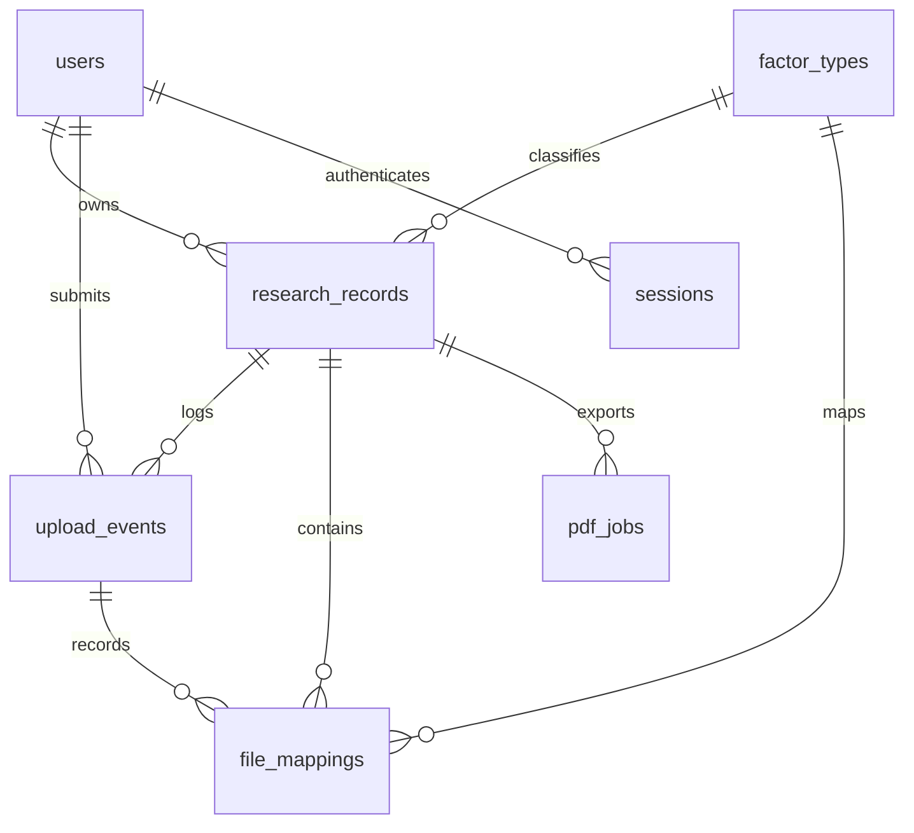

# 数据字典与一致性约束

本项目使用 PostgreSQL。四张核心业务表之外，设置要素字典、登录会话、PDF 任务三张辅助表；`schema_migrations` 仅记录数据库迁移版本。图片和文档原件保存在私有存储目录，数据库保存关系、校验值和元数据。

## 四张核心业务表

| 表 | 主要字段 | 说明 |
| --- | --- | --- |
| `users` 注册信息 | `id`, `email`, `password_hash`, `real_name`, `institution`, `role`, `active`, `created_at`, `updated_at` | 邮箱忽略大小写唯一；密码使用带独立盐的 scrypt 摘要；邮箱暂不验证。实名指必填本人姓名，并非完成法定身份核验。 |
| `upload_events` 上传者信息 | `id`, `uploader_name`, `user_id`, `created_at`, `research_id`, `research_title`, `files`, `action`, `details` | 每次批量上传产生一条记录，姓名、题目、文件 ID/名称/类别为当次快照；创建、编辑与 PDF 转换也留下记录。 |
| `research_records` 研究资料 | `id`, `latest_upload_id`, `owner_id`, `title`, `research_type`, `factor_type_id`, `economic_data_names`, 四类 `*_summary`, `documents`, `version`, 时间字段 | `latest_upload_id` 对应需求中的上传 ID，指向最近一次操作；研究与上传历史一对多。研究类型只允许“要素集聚 / 要素流动 / 其他”。 |
| `file_mappings` 文件映射 | `id`, `research_id`, `factor_type_id`, `upload_id`, `uploaded_by`, `role`, `original_name`, `storage_key`, `mime_type`, `size_bytes`, `sha256`, `is_current`, `created_at` | 每个文件一行，既可按研究取文件，也可按要素类型查询所有文件。替换后旧文件仍保留，`is_current=false`。 |

研究图片包、数据集、指标说明表、论文和四份说明 PDF 通过 `research_records.id → file_mappings.research_id` 关联，避免把文件二进制塞进关系表。研究详情 API 会返回完整 `files` 列表。

| `file_mappings.role` | 资料 | 格式 |
| --- | --- | --- |
| `image_pack` | 研究图片包 | ZIP，内含 PNG/JPG/WebP 图片，可含子目录 |
| `dataset` | 数据集 | XLSX，无宏、无嵌入式对象 |
| `indicators` | 数据指标说明表 | XLSX，无宏、无嵌入式对象 |
| `manuscript` | 论文原稿 | PDF |
| `editor_image` | 网页说明中的插图 | PNG/JPG/WebP，单张 ≤ 8 MB |
| `mechanism_pdf` | 产生机制说明 | 上传或网页生成 PDF |
| `impact_pdf` | 经济影响说明 | 上传或网页生成 PDF |
| `risk_pdf` | 可能风险说明 | 上传或网页生成 PDF |
| `policy_pdf` | 政策启示详情 | 上传或网页生成 PDF |

## 辅助表

- `llm_settings`：迁移 `003_llm_settings.sql` 创建的单行课题组配置。保存启用状态、接口基础地址、模型 ID、JSON 模式、超时、修订版本、更新管理员和更新时间；`api_key_encrypted` 使用 AES-256-GCM 加密，解密密钥位于 `STORAGE_DIR/.secrets/llm.key`。API 不返回密钥，生成建议不写入研究表，用户选用后按正常编辑流程保存。

- `factor_types`：管理员可增添、改名、停用；停用不影响已有研究的读取，但不能在新研究中选择。
- `sessions`：数据库仅保存随机会话令牌的 SHA-256 摘要、CSRF 令牌、用户和有效期；浏览器只持有 HttpOnly Cookie。退出或管理员更改账号权限后撤销会话。
- `pdf_jobs`：保存说明原稿、版本、申请人、任务状态、尝试次数、错误和产出文件；独立进程轮询，最多自动尝试三次。

`documents` 的键固定为 `mechanism / impact / risk / policy`，每项保存 `{ html, revision, pdf_revision?, pdf_file_id? }`。修改 HTML 后保留上次 PDF 并显示待更新；生成成功后记录对应版本。手动上传 PDF 没有可还原的网页原稿，保留现有编辑内容并标记为上传版。系统不承诺把任意 PDF 反向转换为可编辑文档。

成果展示前端直接读取这里保存的 HTML，在左侧阅读窗渲染四类图文全文；读取时再次清理标签和属性，插图继续使用需要登录的文件地址。摘要概览不读取全文，点击研究后才读取正文和当前 PDF 元数据。本次展示功能无需新增数据库表或迁移已有文档；只有手动上传 PDF、没有网页原稿的章节显示摘要及说明 PDF 链接，并明确提示全文尚未录入。

## 关系与并发

1. 上传事件与文件元数据在同一事务内写入；数据库失败时删除本次已写入的对象文件。
2. `(research_id, factor_type_id)` 复合外键以 `ON UPDATE CASCADE` 保证研究改分类后，当前与历史文件均同步归属，上传历史的文字快照不变。
3. `(upload_id, research_id)` 和 `(latest_upload_id, id)` 复合外键防止上传记录关联到另一项研究。
4. 每项研究、每类附件只允许一个当前文件；文档插图除外。旧文件可从上传记录继续下载。
5. 元数据使用 `version` 乐观锁，说明正文使用独立 `revision`。后台转换结果若已过时，任务标记为 `superseded`，不会覆盖新稿。
6. 外键限制删除，管理界面采用停用而非删除用户和要素类型。第一版不提供物理删除成果与历史文件，避免破坏追溯链。

迁移脚本：`server/db/migrations/001_initial.sql`；反向脚本仅供空环境回滚演练，含删除业务表操作，**不得在有资料的库中执行**。数据库迁移命令使用事务和 advisory lock，可重复执行。

## 备份

必须配套备份 PostgreSQL 和整个 `storage`（Docker 为 `research_files` 卷），包括 `objects` 下的文件与 `.secrets/llm.key`。只有数据库备份不包含 PDF、数据集与图片，也无法解密 LLM API Key。需要一致恢复点时暂停 API 和工作进程写入，再同时备份数据库与对象目录；恢复时也成套恢复。运行中进程崩溃可能留下未关联的对象文件，可离线核对 `storage_key` 后清理，不能直接删除所有未显示在“当前版本”中的文件，因为历史与插图仍有引用。
